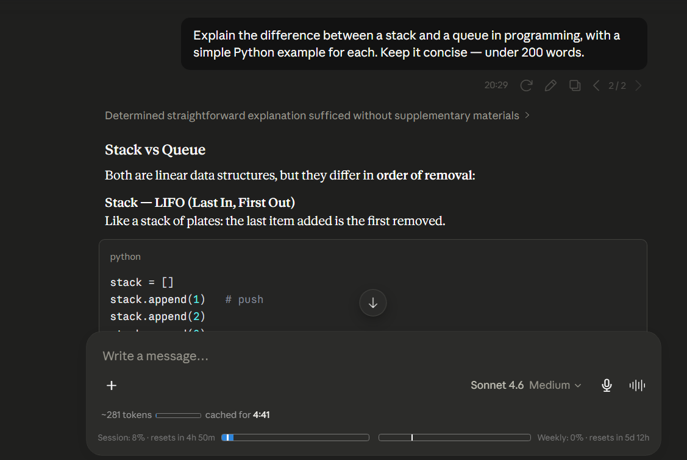

# Claude Counter

A lightweight browser extension that shows token count, cache timer, and usage bars on [claude.ai](https://claude.ai). Zero permissions — all data stays local.

## Features

- **Token count** — Approximate token count for the current conversation, with a mini progress bar scaled to the 200k context window
- **Cache timer** — Countdown showing how long the conversation remains cached (cheaper to continue)
- **Usage bars** — Session (5-hour) and weekly (7-day) usage from Claude's native API, with progress bars and reset countdowns
- **Model-aware** — Detects the active model (Sonnet, Haiku, Opus, Fable) and adjusts the token bar scale accordingly
- **WCAG compliant** — Text meets AA contrast standards for accessibility

## Installation

**Chrome / Edge / Chromium**

1. Download or clone this repository
2. Go to `chrome://extensions` and enable **Developer mode**
3. Click **Load unpacked** and select the extension folder

**Firefox**

1. Go to `about:debugging#/runtime/this-firefox`
2. Click **Load Temporary Add-on** and select `manifest.json`

**Userscript**

1. Install the userscript from [`claude-counter.user.js`](./userscript/claude-counter.user.js)

## How it works

- Intercepts Claude's API responses via a bridge script to read conversation data and usage info
- Uses a vendored tokenizer (`o200k_base`) for approximate token counting
- Reads live SSE `message_limit` events for exact utilization fractions — more accurate than Claude's rounded /usage page
- Three-layer DOM discovery (exact selectors → structural heuristics → floating fallback) ensures the UI survives Claude.ai updates
- Model detection via `aria-label` on the model selector button

## Security & Privacy

- **Zero permissions** — No `storage`, `tabs`, `webRequest`, or host permissions
- **All data stays local** — No external servers, no tracking, no analytics
- **Origin-locked messaging** — All `postMessage` uses `'https://claude.ai'` (never `'*'`)
- **Native API capture** — `fetch` and `postMessage` references captured before page scripts can tamper
- **Data minimization** — Only token counts, message UUIDs, and usage fractions cross the bridge
- **Input validation** — Organization/conversation IDs validated with strict regex patterns
- **CSP hardened** — `script-src 'self'; object-src 'none'`

See [SECURITY.md](./SECURITY.md) and [PRIVACY.md](./PRIVACY.md) for full details.

## Credits

- Token counting via [gpt-tokenizer](https://github.com/niieani/gpt-tokenizer) (MIT)
- Inspired by [Claude Usage Tracker](https://github.com/lugia19/Claude-Usage-Extension) by lugia19
- Original extension by [she-llac](https://github.com/she-llac)

## License

MIT
